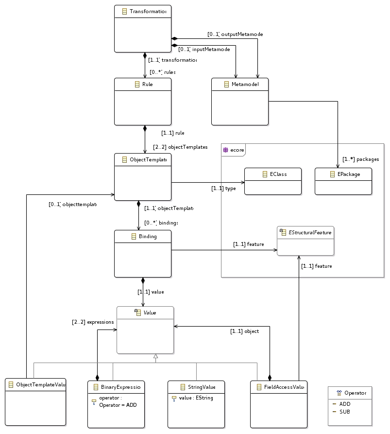
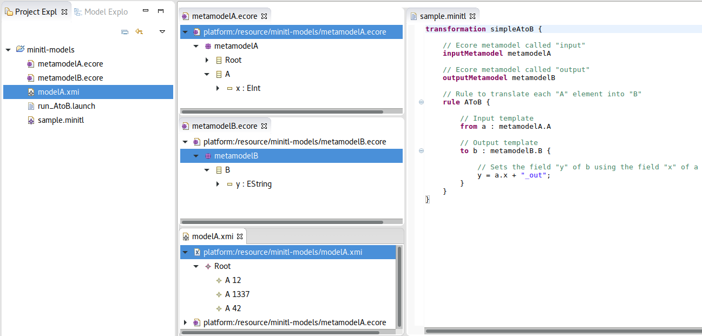
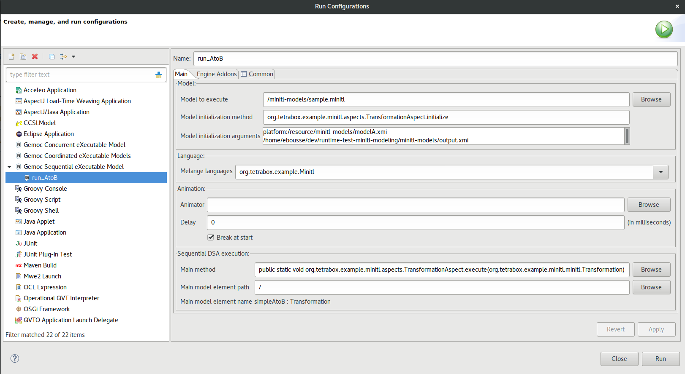
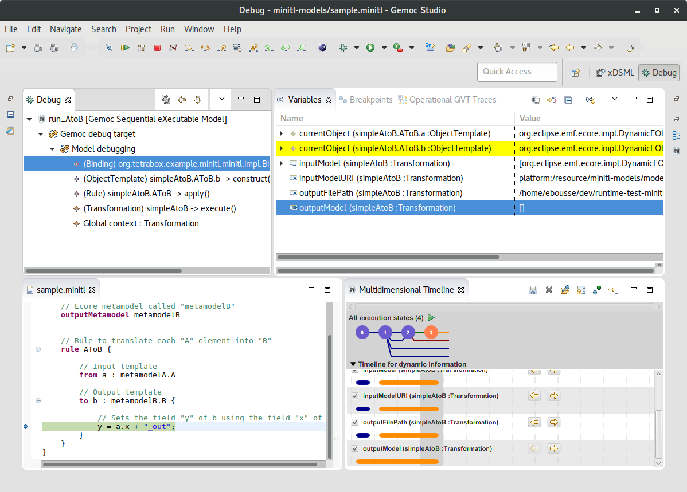

# Presentation

**MiniTL** is a minimalisting toy model transformation language for [EMF](http://www.eclipse.org/modeling/emf/) models. It enables the definition of transformations, which consist of rules. A rule specifies how is transformed an input object of an input model into a new output object.

## Editor + concrete syntax example

## Abstract syntax (Ecore model)

# Compilation and usage

## Organization of the code

Main eclipse plugins:

- `org.tetrabox.example.minitl.model` contains the metamodel of MiniTL, using the Ecore language.
- `org.tetrabox.example.minitl.semantics` contains the operational semantics of MiniTL (ie. the interpreter), using the [Kermeta3](http://diverse-project.github.io/k3/) language.
- `org.tetrabox.example.minitl.xdsml` contains the definition of the language using the [Melange](http://melange.inria.fr/) language.
- `org.tetrabox.example.minitl` contains the *language runtime* generated by Melange, *ie.* a new Ecore model that contains both static elements (from `org.tetrabox.example.minitl.model`) and dynamic features (from `org.tetrabox.example.minitl.semantics`), along with a copy of the semantics that is compatible with this new Ecore model. In other words, once this project has been generated, it is systematically used in place of `org.tetrabox.example.minitl.model` or `org.tetrabox.example.minitl.semantics`.
- `org.tetrabox.example.minitl.tcs` contains the textual concrete syntax of MiniTL, using [Xtext](https://eclipse.org/Xtext/). Please note that this syntax is defined for the generated metamodel that can be found in `org.tetrabox.example.minitl.model`, and not on the original metamodel found in `org.tetrabox.example.minitl.model` (see previous item for explanations).

## Compilation

All the projects must be imported in a workspace of the [GEMOC Studio](http://gemoc.org/studio). Then wait for the build to finish.

## Usage

### Write a transformation

- When everything is compiled in the GEMOC Studio, launch a new Eclipse instance.
- Create an empty project.
- Set the Xtext nature on the project: right click, *Configure*, *Add Xtext nature*.
- Create input and output metamodels using Ecore, in one or two separate `ecore` files.
- Create an input model conforming to the input metamodel, using right click *Create dynamic instance* in the Ecore editor.
- Create a file with the extension `.minitl`.
- Open the file, and use the MiniTL textual editor to write a transformation that relies on the previously created input and output metamodels.

Example of editing workspace and session:

### Configure a transformation run

- Create a new Eclipse run configuration of type *Gemoc Sequential eXecutable Model*
- Fill the fields in this way:
	- Model to execute: the `.minitl` file
	- Model initialization arguments: the first line should be a `platform:/resource` URI pointing to the input model conforming to the input metamodel; the second line shoud be an absolute filesystem path to the output model serialized by the MiniTL transformation.
	- Melange languages: choose MiniTL from the list.
	- Tick the box "*Break at start*" (so that the debugger has an automatic breakpoint at the beginning of the transformation).
	- Main method: pick the only one in the list.
	- Main model element path: pick the only *Transformation* element in the list.

Example of run configuration:

### Execute and debug the transformation

- To simply run the transformation, start the run configuration in *run* mode. After execution, the output model file should be produced at the specified location.
- To debug the transformation:
	- Start the run configuration in *debug* mode. When asked to switch to the debug viewpoint, accept.
	- Now you can see dynamic information in the upper right corner, see at stack trace in the upper left part, and use all Eclipse debug buttons (step into, step out) to execute piece per piece your MiniTL transformation.

Examples of debugging session with a MiniTL stack trace:

# TODO

- Add static semantic (ie. a `Validator`)
- Improve textual syntax
- See how to feed the GEMOC Studio with a static xtext model, that should be translated into a dynamic version
