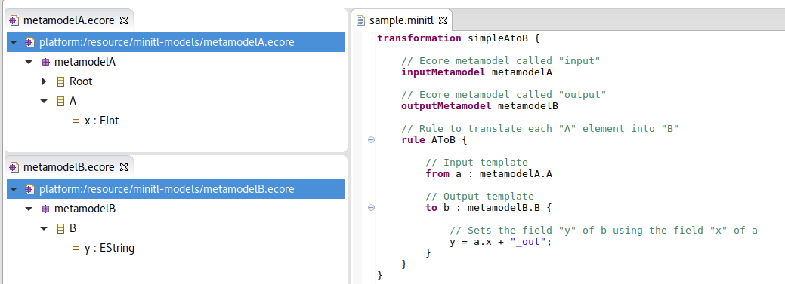

# Presentation

MiniTL is a minimalisting toy model transformation language for [EMF](http://www.eclipse.org/modeling/emf/) models. It enables the definition of transformations, which consist of rules. A rule specifies how to (simply) transform each object of an input model into a new object.

## Editor + concrete syntax example

## Abstract syntax (Ecore model)

# Compilation and usage

## Organization of the code

Main eclipse plugins:

- `org.tetrabox.example.minitl.model` contains the metamodel of MiniTL, using the Ecore language.
- `org.tetrabox.example.minitl.semantics` contains the operational semantics of MiniTL (ie. the interpreter), using the [Kermeta3](http://diverse-project.github.io/k3/) language.
- `org.tetrabox.example.minitl.tcs` contains the textual concrete syntax of MiniTL, using [Xtext](https://eclipse.org/Xtext/).

## Compilation

All the projects must be imported in a workspace of the [GEMOC Studio](http://gemoc.org/studio). Then wait for the build to finish.

## Usage

When everything is compiled in the GEMOC Studio, launch a new Eclipse instance, and start playing with the textual editor.

Coming soon: the possibility to execute and debug MiniTL models using the GEMOC Studio features.

# TODO

- GEMOC execution engine integration (need Melange project)
- Add static semantic (ie. a `Validator`)
- Improve textual syntax
